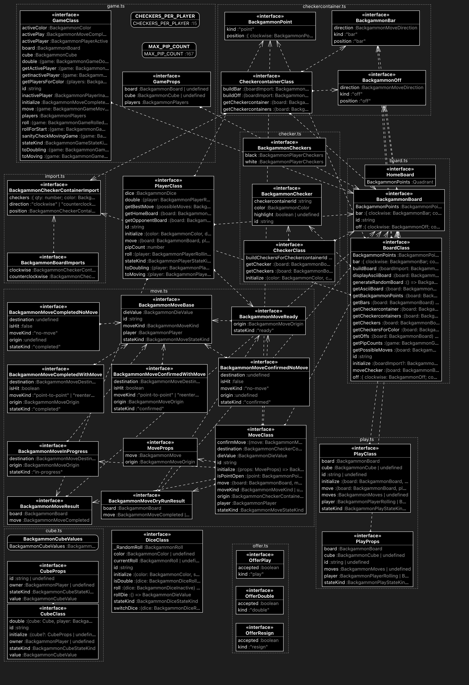

# @nodots-llc/backgammon-types

Type definitions for the nodots-backgammon project. This package provides TypeScript type definitions and interfaces for representing backgammon game states, moves, and related functionality.

## Overview

This package contains TypeScript type definitions for:

- Game state and management
- Board representation
- Checker movements and positions
- Dice rolls and cube decisions
- Player information and states
- Move validation and game rules
- Game offers and decisions

## Installation

Install the package from npm:

```bash
npm install @nodots-llc/backgammon-types
```

## Project Structure

The type definitions are organized into the following modules:

- `board.ts` - Board state and position types
- `checker.ts` - Checker representation and movement
- `checkercontainer.ts` - Container management for checkers
- `cube.ts` - Doubling cube related types
- `dice.ts` - Dice roll types and validation
- `game.ts` - Core game state and management
- `move.ts` - Move representation and validation
- `offer.ts` - Game offers (double, resign, etc.)
- `pip.ts` - Pip counting and management
- `play.ts` - Play action types and validation
- `player.ts` - Player state and management

## Usage

Import the types you need in your TypeScript files:

```typescript
import { Game, Move, Player, Board } from '@nodots-llc/backgammon-types'
```

## Model



## Changelog

### Version 3.7.2

**Breaking Changes:**
- Removed `allowDraw` setting from game configuration - Backgammon doesn't support draws as a game outcome

**New Features:**
- Enhanced roll-for-start functionality with dedicated type definitions
- Added `BackgammonDiceRollingForStart` and `BackgammonDiceRolledForStart` for starting phase dice states
- Added `BackgammonPlayerRollingForStart` and `BackgammonPlayerRolledForStart` for starting phase player states

**Improvements:**
- Fixed moves on activePlay to be required fields in all appropriate states
- Better import organization and type safety
- Updated .gitignore to exclude compiled files from package

### Version 3.2.0

**New Features:**

- Added `BackgammonGameMetadata` interface for game metadata (title, description, tags, tournament info)
- Added `BackgammonGameStatistics` interface for game statistics tracking (moves, rolls, timing, pip counts)
- Added `BackgammonGameTiming` interface for time management and limits
- Enhanced `BackgammonGame` interface with new optional attributes:
  - `metadata?: BackgammonGameMetadata` - Game metadata and tournament information
  - `statistics?: BackgammonGameStatistics` - Game statistics and history
  - `timing?: BackgammonGameTiming` - Time management settings
  - `version: string` - Game format version for compatibility
  - `rules` - Backgammon rule variations (Crawford, Jacoby, Beaver, etc.)
  - `settings` - Game settings (undo, resign, hints, etc.)

**Breaking Changes:**

- None - all new attributes are optional and backward compatible

## Development

### Prerequisites

- Node.js (Latest LTS recommended)
- npm

### Setup

1. Clone the repository
2. Install dependencies:
   ```bash
   npm install
   ```

### Building

To compile the TypeScript files:

```bash
npm run build
```

This will generate the compiled JavaScript and type definition files in the `dist` directory.

### Scripts

- `npm run build` - Compiles the TypeScript code
- `npm run prepare` - Runs automatically before the package is packed or installed

## License

MIT License - See LICENSE file for details

## Author

Ken Riley <kenr@nodots.com>
